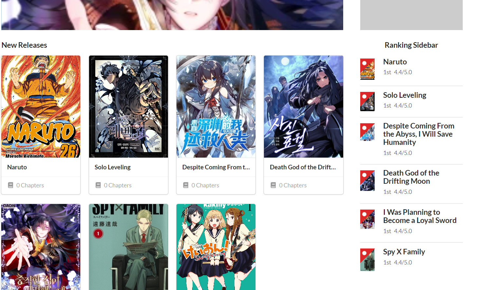

# Comic Reading Website with Python Flask
#### Video Demo:  <https://youtu.be/nJLUzqVjnjE>
#### Description:
This is the final project I made for cs50 course. This is a comic reading website with basic CRUD operations to CREATE, UPDATE and DELETE comics that can be read by users visiting the website.

This project uses python and flask and was built on top the flask-base boilerplate code. [Flask-Base Boilerplate](https://github.com/hack4impact/flask-base)

## Features

* HomePage (Shows all the comics)
* Info Page
* Reading Page
* Admin Dashboard
* Manage Comics (CRUD for Comics)
* Create and Edit Users
* Login and Register
* Email Confirmation on registration
* Crousal Banner on Home Page
* Chapter uploading
* Raking sidebar
* Basic Breadcrumbs
* Mobile Responsive


## Demos

Home Page:



Admin DashBoard:


Manage Comic DashBoard:


Reading Page:


Info Page:


#### GETTING STARTED (steps)

##### Initialize a virtual environment

Windows:
```
$ python3 -m venv venv
$ venv\Scripts\activate.bat
```

Unix/MacOS:
```
$ python3 -m venv venv
$ source venv/bin/activate
```
Learn more in [the documentation](https://docs.python.org/3/library/venv.html#creating-virtual-environments).

Note: if you are using a python before 3.3, it doesn't come with venv. Install [virtualenv](https://docs.python-guide.org/dev/virtualenvs/#lower-level-virtualenv) with pip instead.

##### (If you're on a Mac) Make sure xcode tools are installed

```
$ xcode-select --install
```

##### Add Environment Variables

Create a file called `config.env` that contains environment variables. **Very important: do not include the `config.env` file in any commits. This should remain private.** You will manually maintain this file locally, and keep it in sync on your host.

Variables declared in file have the following format: `ENVIRONMENT_VARIABLE=value`. You may also wrap values in double quotes like `ENVIRONMENT_VARIABLE="value with spaces"`.

1. In order for Flask to run, there must be a `SECRET_KEY` variable declared. Generating one is simple with Python 3:

   ```
   $ python3 -c "import secrets; print(secrets.token_hex(16))"
   ```

   This will give you a 32-character string. Copy this string and add it to your `config.env`:

   ```
   SECRET_KEY=Generated_Random_String
   ```

2. The mailing environment variables can be set as the following.
   We recommend using [Sendgrid](https://sendgrid.com) for a mailing SMTP server, but anything else will work as well.

   ```
   MAIL_USERNAME=SendgridUsername
   MAIL_PASSWORD=SendgridPassword
   ```

Other useful variables include:

| Variable        | Default   | Discussion  |
| --------------- |-------------| -----|
| `ADMIN_EMAIL`   | `admin@example.com` | email for your first admin account |
| `ADMIN_PASSWORD`| `password`                     | password for your first admin account |
| `DATABASE_URL`  | `data-dev.sqlite`              | Database URL. Can be Postgres, sqlite, etc. |
| `REDISTOGO_URL` | `http://localhost:6379`        | [Redis To Go](https://redistogo.com) URL or any redis server url |
| `RAYGUN_APIKEY` | `None`                         | API key for [Raygun](https://raygun.com/raygun-providers/python), a crash and performance monitoring service |
| `FLASK_CONFIG`  | `default`                      | can be `development`, `production`, `default`, `heroku` and `unix`. Use `development` with this application.|
| `APP_NAME`  | `Comic-Reader`                      | This will be the name of the website|


##### Install the dependencies

```
$ pip install -r requirements.txt
```

##### Other dependencies for running locally

You need [Redis](http://redis.io/), and [Sass](http://sass-lang.com/). Chances are, these commands will work:


**Sass:**

```
$ gem install sass
```

**Redis:**

_Mac (using [homebrew](http://brew.sh/)):_

```
$ brew install redis
```

_Linux:_

```
$ sudo apt-get install redis-server
```


##### Create the database

This command creates new db according to model schemas
Will create db according to envoirment i.e production, develoment etc.

```
$ python manage.py recreate_db
```

##### Other setup (e.g. creating roles in database)

setup_dev uses development enviorment

```
$ python manage.py setup_dev
```

or
setup_prod uses production enviorment

```
python manage.py setup_prod
```
if using production

Note that this will create an admin user with email and password specified by the `ADMIN_EMAIL` and `ADMIN_PASSWORD` config variables. If not specified, they are both `admin@example.com` and `password` respectively.


## Running the app

```
$ source env/bin/activate
$ honcho start -e config.env -f Local
```

##### Create and run the images:

```
$ docker-compose up
```

##### Create database and initial data for development:

```
$ docker-compose exec server ./init_database.sh
```

It will deploy 5 docker images:

- server: Flask app running in [http://localhost:5000](http://localhost:5000).
- worker: Worker ready to get tasks.
- postgres: Postgres SQL isolated from the app.
- adminer: Web client for database management, running in [http://localhost:8080](http://localhost:8080).
- redis: Redis SQL isolated from the app

## Lets Talk about it a bit more
This project used flask boilerplate code as a building block. So many of the features that were present in that codebase are present here. Only minimal features like CKeditor were removed as they provided no purpose for our application.

#### Models
So ofcourse I had to make custom db models and schemas for comics as they were not provided in the flask base codebase.

* Comic
* Chapter
* Genre
* Altername
* Page

All these models were sepcially made for comic reader. Tho still simplistic, I just did the bare minimum with these db models and didn't add any unnecessary complication like view counter and rating counter.

And genre model should have done with using a assciative table with comic, because right now it stores redundant information but I was to lazy.

I also added couple of useful function with each db model to make my life easier in the future


#### FORMS
Custom Forms I made

* NewComicForm
* UploadChapter
* UpdateComic
* DeleteComic

All forms are really basic and nothing really complex has been added to them, as I said before I wanted to keep the complexity at a minimum so that I could complete this project in the alloted time.


#### Comic View Routes
Now this part is the most intersting and complex.
Views I made for comic router are

* new_comic(POST, GET)
* delete(POST, GET)
* upload_chapter(POST, GET)
* show_comic(GET)
* show_chapter(GET)
* manage(GET)
* index(GET)

```
new_comic('/new-comic', GET, POST)
```
new_comic route is used to create a new comic. If works both on GET and POST. In GET request it just renders a HTML template with form to create a new comic. In POST it takes data from the form. Verifies it and then processes it. Form also takes a image file which serves as the cover image of the newly created comic. Then all the data after processing is added to db. New folder is also created for the comic data in /static/data/{comic.randomName}.


```
delete('/new-comic', GET, POST)
```
It is used to remove the comic from db. It also removes all the genre, alternative names assosiated with the comic. It also deletes comic data folder assosiated with the comic.


```
upload_chapter('/new-comic', GET, POST)
```
This route is used to upload a chapter of a specific comic. It also has form to take data from the user. The unique part about this route is that is takes a zifile as chapter upload file. It reads the zipfile, extracts it to a temp directory located at /temp and then sorts the list of files in directory. The route then creates a new folder in comic folder /static/data/{comic.RandomName}/{chapter.RandomName} and moves all the data from /temp/ to chapter folder.


```
show_comic(GET)
```
This routes just renders the template/comic/info_page.html template with specific comic information.


```
show_chapter(GET)
```
This routes renders the template /template/comic/read_chapter.html with specific comic and specific chapter. This allows the visiter to read that chapter.


```
manage(GET)
```
Just renders a page that show all CRUD options availible to the admin


```
index(GET)
```
Renders Homepage.
